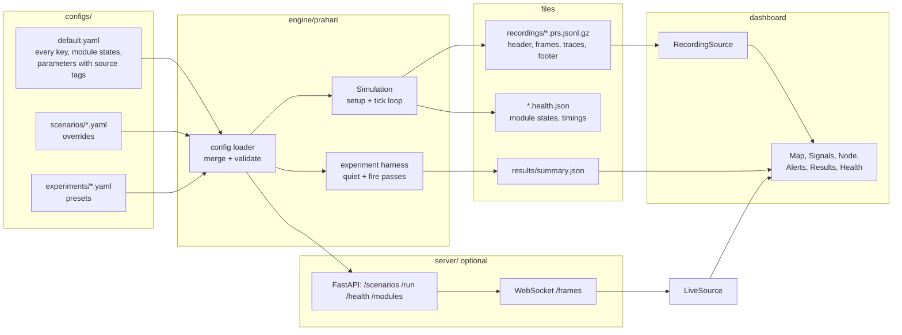
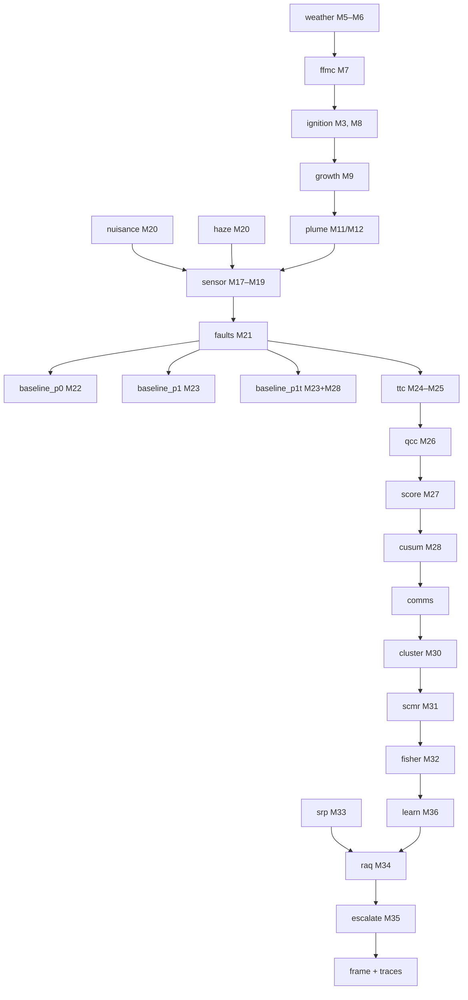

# Architecture 1 — the system at a glance

PRAHARI-SIM has three parts that talk only through files: a **configuration** that describes a world and chooses
which model runs for each module, an **engine** that simulates it minute by minute, and a **dashboard** that replays
what the engine wrote. A live server (`server/`, Phase 6) streams the same lines over a WebSocket; the dashboard never requires it.

## One minute of simulated time

Every tick (one simulated minute) runs the same chain. Each box is a **stage** with `real`, `stub` and `off`
versions; the configuration decides which runs.

Before the first tick three **setup** stages run once: `landscape` (M2–M3), `siting` (M1, M4) and `links` (M38).

## State of the modules (after Phase 9)

| Group | Real by default | Stub by default (real version, and where it runs) |
| --- | --- | --- |
| World | landscape, siting, links | — |
| Environment | weather, ffmc | — |
| Fire | ignition; plume (Gaussian, opt-in) | growth (M9 legacy is the default), plume (M12 legacy is the default) |
| Signals | sensor, nuisance, haze | faults (M21, Phase 9: `sensor_fault`) |
| Baselines | P0, P1, P1t | — |
| Node layer | ttc, qcc, cusum | score (with one channel and c = 1 the stub *is* M27; M29 health weights, Phase 9: `sensor_fault`) |
| Edge layer | cluster, scmr, fisher, srp (legacy day type; integral form selectable), raq (legacy quorum; Bayes selectable), escalate | comms (Phase 8: `gateway_outage`, `cloudy_days`), learn (the stub *is* the M34 bound; M36 fit with a model file, Phase 9) |
| Other | — | energy (Phase 8 scenarios), satellite (M37, Phase 9 scenarios) |

## Design principles that shape the architecture

| Principle | What it means in practice |
| --- | --- |
| Stubs are sacred | Every stage has a simple version that always works; real versions are added beside it. |
| States come from configuration | No code decides which implementation runs; YAML does. |
| Failures degrade, never crash | A failing real stage is replaced by its stub for the rest of the run and marked degraded. |
| Contracts are additive | Stage outputs are small data classes that only ever gain fields. |
| Determinism | One master seed, one random stream per module; same seed → identical bytes. |
| Replay first | The dashboard reads files; no server is needed. |
| Honest labelling | Every parameter has a source tag; every value shown is SIM. |

Details: [02-engine.md](02-engine.md), [04-data-contracts.md](04-data-contracts.md), [05-dashboard.md](05-dashboard.md).
