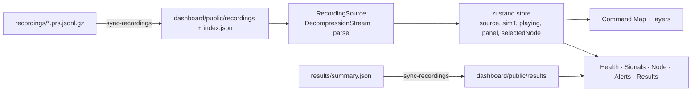

# Architecture 5 — the dashboard

React 18 + TypeScript + Vite, with zustand for state and ECharts for charts. It runs entirely in the browser and
reads files; no engine or API server is needed.

## Data flow

- `scripts/sync-recordings.mjs` runs before `dev` and `build`, copies recordings and the results summary into
  `public/` and writes `index.json` for the recording picker.
- `public/storyboard.json` (Phase 10) is copied to `dist/` as is and fetched at run time, so the presenter's captions
  and bookmarks can be edited on the demo laptop without a rebuild. The launchers in `scripts/` serve `dist/` over
  HTTP on localhost, since browsers refuse module scripts and `fetch()` from `file://`.
- `sources/FrameSource.ts` is the interface every data source implements (`header`, `frameCount`, `frameAt`,
  `span`); `RecordingSource.ts` implements it from a file, decompressing with the browser's `DecompressionStream`.
  `LiveSource.ts` (Phase 6) buffers the WebSocket lines and hands the store a fresh `LiveView` (a `RecordingSource`
  over what has arrived) about four times a second; `updateSource` keeps the clock and follows the live edge.
- `store.ts` keeps the playback clock (`simT`), speed, selected node and open tab. `useFrame()` returns the frame at
  the current time.

## Views

| View | Component(s) | Shows |
| --- | --- | --- |
| Header strip | `HeaderStrip.tsx`, `SimBadge.tsx`, `RecordingPicker.tsx` | scenario, layout and coverage, clock, day type, prior, required quorum, weather, SIMULATION badge; the recording picker with the regime selector (View 8, Phase 9: filters the bundled recordings by the Regime Card in each header, read from `index.json`) and the loaded recording's card — label, radio plan, alert format, lightning |
| Command Map | `CommandMap.tsx`, `MapLayers.tsx`, `MapTools.tsx` | nodes coloured by state (candidate pulses), fires with wind arrows, layers: interfaces, ignition likelihood, smoke, baselines, radio links, detection radius, satellite pixels; Phase 8 recordings add packets (`CommsLayers.tsx`: uplinks fading with age — delivered pine, collided amber dashed, candidate frames thicker than heartbeats — and queue badges) and stored energy (ring gauges filled to state of charge, coloured by power mode); a gateway out of service is crossed out; nodes whose health weight is below 0.1 are drawn as faults ("this sensor abstains", Phase 9); layout toggle and preview |
| Race timeline | `RaceTimeline.tsx` | Phase 9 (View 4), under the map when a recording has fires: ignition, first node candidate and PRAHARI confirmation within 150 m, the overpass that sees the fire, missed overpasses (crosses) and the satellite alert (M37), with the deltas and a headline ("PRAHARI confirmed … before the satellite alert"); a fire selector when there are several |
| Time controls | `TimeControls.tsx` | play, speed, step, scrub bar with event markers |
| Health & model card | `ModuleHealth.tsx` | module states, degradations, equation, tag, source, notes |
| Signals | `SignalsPanel.tsx` | weather strip, haze, a node's reading, eight nodes as small multiples |
| Node | `NodePanel.tsx`, `NodeInspector.tsx` | readout and badges (calibration n and floor); stacked charts: reading and baseline, fast residual, p-value with floor, CUSUM with h and candidates, health weight; power mode, queue and relay in the readout and a state-of-charge chart with the ULP and stop levels (Phase 8 recordings) |
| Alerts | `AlertsPanel.tsx`, `MechanismSwitches.tsx`, `WhyPanel.tsx` | mechanism switches with live counters (View 5); "Why this alarm" (View 3): escalation ladder, SCMR gauge, Fisher evidence, prior, Bayes bar, explanation; clickable alert list |
| Live engine | `LivePanel.tsx` | server URL, scenario, speed, start/stop, status (optional; replay needs none of it) |
| Results | `ResultsPanel.tsx`, `ExperimentCharts.tsx` | false incidents per month for P0–P2 (log axis, M45 intervals, per-seed ticks, report intervals), detection within 3 h (M44), the ablation chart (P2 and each mechanism removed, with its confirmation rate), the operating dial (false incidents against median time to confirm), node spacing (confirmed and single-node within 3 h at 70/100/150 m), the table, the node-layer calibration table, the energy chart (Wh per day per sensor mode on a log axis as lollipops — bars cannot start from zero on a log axis — against the clear-day harvest line and the cloudy-day band), and, from Phase 9 (`LearningCharts.tsx`), the M36 learning curve (confirmation rate at the fixed false-alarm budget and median minutes to confirm against K, as two small multiples, the bound as a dashed reference, hollow points where K < k_min) and the M26 maturity curve (p_min on a log axis and median minutes to the first node candidate against days of calibration data); every chart footer names its seeds and simulated days, or states that it involves no random draws |
| Presenter strip | `PresenterOverlay.tsx` | Phase 10 (SPEC §6.4): under the header while a storyboard step is active — step number and title, the line to say, a note after S/R or a load problem, and the keys; keys 1–9 apply a step from `storyboard.json` (recording from a per-session cache, bookmark, speed, layers, tab, play or hold, scroll), S and R open the SCMR/RAQ replay variants keeping the clock, F toggles full screen, Esc hides the strip; `?presenter` opens step 1 |
| Footer | `Footer.tsx` | seed, simulated days (and first recorded day for warm starts), frames, SIM |

Chart panels are loaded lazily when their tab opens, so the map view stays light.

### Robustness (release 1.0)

- **Error boundaries** (`ErrorBoundary.tsx`) wrap the header, the map, the race timeline, the recording picker, each
  tab's panel and the time controls. A view that throws shows a short notice with the error and a retry button. It
  resets when the recording or tab changes. The other views, the keys and presenter mode keep working.
- **Layout.** The map keeps at least 360 px of height; on small screens (for example 1280 × 720) the left column
  scrolls instead of squeezing the map away.
- **Incomplete recordings.** A final line cut off mid-write is skipped, and the footer marks the recording as
  incomplete; any other malformed line is still refused with its line number.
- **Race timeline honesty.** When a recording's satellite side is the stub (a fixed delay after ignition, not M37),
  the marker is labelled as the stub and no race is claimed in the headline.

## Pure helpers (unit-tested with Vitest)

| File | What it computes |
| --- | --- |
| `layers.ts` | colour ramps (SF, likelihood, smoke), plume grid decoding (float16), glow opacity, recent baseline alarms |
| `series.ts` | time series from frames: weather, haze bands, node fields, p floor, h, candidate markers; thinning |
| `results.ts` | chart rows for false alarms and detection (main set or ablation set), dial points, spacing points, energy rows, log bounds, node-layer rows; everything is read from `summary.json`, nothing is hard-coded |
| `format.ts` | clock, compact numbers, simulated-days label |
| `race.ts` | Phase 9: fire ids, the race for one fire from events and alerts (candidates and confirmations within 150 m), the deltas and headline |
| `regimes.ts` | Phase 9: regimes present among the bundled recordings, filtering by regime, the card summary line |
| `learning.ts` | Phase 9: learning-curve points in K order, the "monotone within noise" check (acceptance 2) |
| `presenter.ts` | Phase 10: the storyboard types, bookmark minutes from day and time, storyboard validation, planned rehearsal seconds, key → action mapping |
| `comms.ts` | Phase 8: recent packets over a window (with carried minutes), packet outcome, gauge arcs, whether a recording has the radio and energy models |
| `edge.ts` | replay-variant names, live counters (M46 rule), log-scale positions, the escalation ladder |
| `sources/LiveSource.ts` | applying streamed lines, WebSocket URL |

## Visual language

- Dark theme with tokens in `theme.css`: background, panel, text, text-2, line.
- **Ember, amber and pine are reserved for node states** (candidate/confirmed, elevated, normal); grey is for the
  baselines; ember will also mark PRAHARI pipelines in results.
- Chart series use one validated blue; reference lines (baseline, floor, h) are grey and dashed with end labels.
- Spreading factor uses a single-hue ordinal ramp; smoke a single slate hue on a log scale; ignition likelihood a warm
  white ramp.
- Colour choices were checked with the dataviz palette validator (contrast, colour-vision-deficiency separation).
- Every view shows the SIMULATION badge, and every chart footer states seeds and simulated days (CLAUDE.md rule 15).
