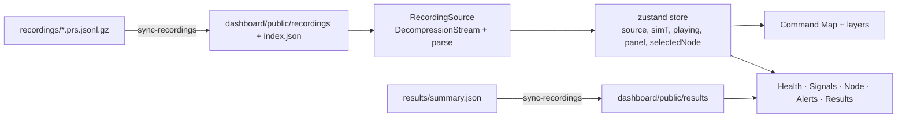

# Architecture 5 — the dashboard

React 18 + TypeScript + Vite, with zustand for state and ECharts for charts. It runs entirely in the browser and
reads files; no engine or API server is needed.

## Data flow

- `scripts/sync-recordings.mjs` runs before `dev` and `build`, copies recordings and the results summary into
  `public/` and writes `index.json` for the recording picker.
- `sources/FrameSource.ts` is the interface every data source implements (`header`, `frameCount`, `frameAt`,
  `span`); `RecordingSource.ts` implements it from a file, decompressing with the browser's `DecompressionStream`.
  A live source (Phase 6) will implement the same interface.
- `store.ts` keeps the playback clock (`simT`), speed, selected node and open tab. `useFrame()` returns the frame at
  the current time.

## Views

| View | Component(s) | Shows |
| --- | --- | --- |
| Header strip | `HeaderStrip.tsx`, `SimBadge.tsx` | scenario, layout and coverage, clock, day type, prior, required quorum, weather, SIMULATION badge |
| Command Map | `CommandMap.tsx`, `MapLayers.tsx`, `MapTools.tsx` | nodes coloured by state (candidate pulses), fires with wind arrows, layers: interfaces, ignition likelihood, smoke, baselines, radio links, detection radius, satellite pixels; layout toggle and preview |
| Time controls | `TimeControls.tsx` | play, speed, step, scrub bar with event markers |
| Health & model card | `ModuleHealth.tsx` | module states, degradations, equation, tag, source, notes |
| Signals | `SignalsPanel.tsx` | weather strip, haze, a node's reading, eight nodes as small multiples |
| Node | `NodePanel.tsx`, `NodeInspector.tsx` | readout and badges (calibration n and floor); stacked charts: reading and baseline, fast residual, p-value with floor, CUSUM with h and candidates, health weight |
| Alerts | `AlertsPanel.tsx` | alert list with the trace's explanation |
| Results | `ResultsPanel.tsx` | false incidents per month (log axis, M45 intervals, per-seed ticks, report intervals), detection within 3 h (M44), table, node-layer calibration table |
| Footer | `Footer.tsx` | seed, simulated days (and first recorded day for warm starts), frames, SIM |

Chart panels are loaded lazily when their tab opens, so the map view stays light.

## Pure helpers (unit-tested with Vitest)

| File | What it computes |
| --- | --- |
| `layers.ts` | colour ramps (SF, likelihood, smoke), plume grid decoding (float16), glow opacity, recent baseline alarms |
| `series.ts` | time series from frames: weather, haze bands, node fields, p floor, h, candidate markers; thinning |
| `results.ts` | chart rows for false alarms and detection, log bounds, node-layer rows |
| `format.ts` | clock, compact numbers, simulated-days label |

## Visual language

- Dark theme with tokens in `theme.css`: background, panel, text, text-2, line.
- **Ember, amber and pine are reserved for node states** (candidate/confirmed, elevated, normal); grey is for the
  baselines; ember will also mark PRAHARI pipelines in results.
- Chart series use one validated blue; reference lines (baseline, floor, h) are grey and dashed with end labels.
- Spreading factor uses a single-hue ordinal ramp; smoke a single slate hue on a log scale; ignition likelihood a warm
  white ramp.
- Colour choices were checked with the dataviz palette validator (contrast, colour-vision-deficiency separation).
- Every view shows the SIMULATION badge, and every chart footer states seeds and simulated days (CLAUDE.md rule 15).
